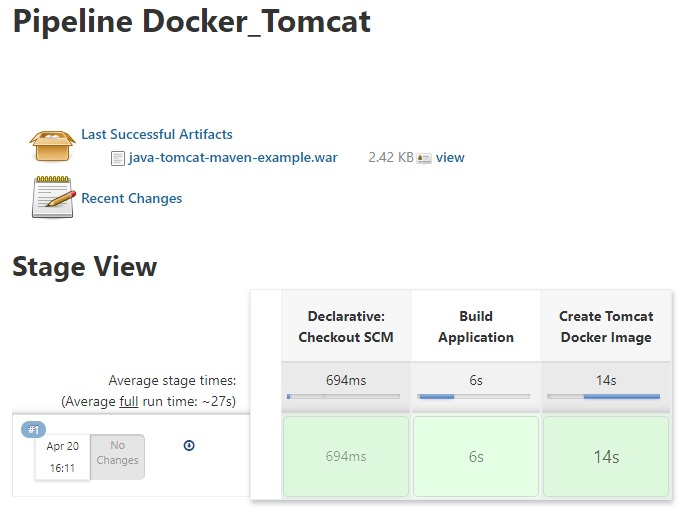

## This is a demo on Jenkins Ci using Tomcat docker image.
## We will use Jenkins file to create build pipeline in Jenkins allowing it to build the docker image and exposing the Tomcat webserver.
---
### Jenkins file
```
pipeline {
    agent any
    stages {
        stage('Build Application') {
            steps {
                sh 'mvn -f pom.xml clean package'
            }
            post {
                success {
                    echo "Now Archiving the Artifacts...."
                    archiveArtifacts artifacts: '**/*.war'
                }
            }
        }
 
        stage('Create Tomcat Docker Image'){
            steps {
                sh "docker build . -t tomcatsamplewebapp:${env.BUILD_ID}"
            }
        }
 
    }
}

```
---
### Dockerfile
```
FROM tomcat:8.0
 
ADD **/*.war /usr/local/tomcat/webapps
 
EXPOSE 8080
 
CMD ["catalina.sh", "run"]
```

